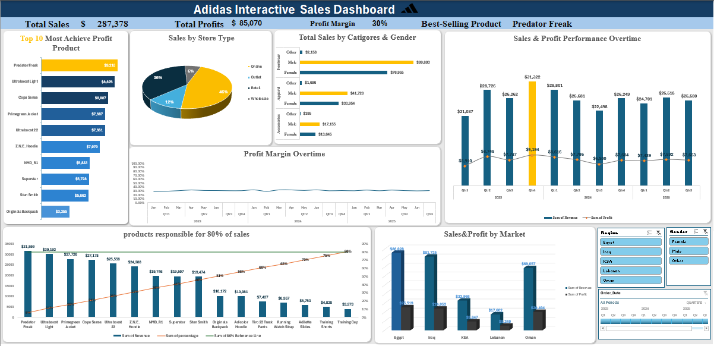

# Adidas Interactive Sales Dashboard

An interactive **Microsoft Excel dashboard** designed to analyze Adidas sales performance and provide valuable business insights using data visualization and interactive filtering.

## 📊 Dashboard Overview

This project provides a comprehensive analysis of Adidas sales data, including:

- 💰 Total Sales
- 📈 Total Profit
- 📊 Profit Margin
- 🏆 Best-Selling Product
- 🛍️ Sales by Product
- 🏪 Sales by Store Type
- 👥 Sales by Category and Gender
- 📅 Sales and Profit Performance Over Time
- 📉 Profit Margin Over Time
- 🌍 Sales and Profit by Market
- 🔝 Top 10 Most Profitable Products
- 📊 Pareto Analysis to identify products responsible for 80% of sales

## ✨ Features

- Interactive Excel Dashboard
- Dynamic charts and visualizations
- PivotTables and PivotCharts
- Interactive slicers for filtering data
- Sales and profit performance analysis
- Product and market performance insights
- Pareto analysis for identifying key revenue-generating products

## 🛠️ Tools Used

- Microsoft Excel
- PivotTables
- PivotCharts
- Slicers
- Excel Formulas
- Data Visualization Techniques

## 📈 Key Insights

The dashboard helps answer important business questions such as:

- Which products generate the highest profits?
- Which store types generate the most sales?
- What are the best-selling Adidas products?
- How do sales and profits change over time?
- Which markets perform best?
- Which products contribute to approximately 80% of total sales?

## 📷 Dashboard Preview

## 📂 Project Files

- `Adidas Sales Dashboard.xlsx` – Excel dashboard and analysis
- `Adidas.PNG` – Dashboard preview image

## 👩‍💻 Author

**Shahd Elsayed**

Aspiring Data Analyst passionate about transforming raw data into meaningful insights through data analysis and visualization.

---
⭐ If you like this project, feel free to give it a star!
